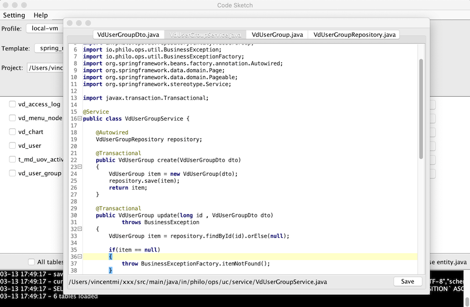

# Code Sketch

Vincent Mi (miwenshu@gmail.com)


用于根据数据库设计生成骨架代码.



## 使用

将模板文件拷贝到 ```~/.codesketch/templates```下.


## 模板变量

模板使用 FreeMarker 语法请参考参考 [http://freemarker.foofun.cn/ref.html](http://freemarker.foofun.cn/ref.html)

#### 符号
| 变量 | 类型 | 示例 | 说明 |
|---| --- | ---- |---|
| ```${TAG_LEFT}```  |String | < | 标签符号左 |
| ```${TAG_RIGHT}```  |String | > | 标签符号右 |
| ```${TAG_DALLAR}```  |String | $ | 美元符号 |
| ```${TAG_WELL}```  |String | # |井号 |
| ```${TIME}```  |String | 2020-03-12 18:26:40 654 CST | 文件生成的时间 |

#### 基本变量
| 变量 | 类型 | 示例 | 说明 |
|---| --- | ---- |---|
| ```${projectPath}```  |String | /User/vicnent/dev/blog| 目标项目路径 |
| ```${table}```  |String | user_info | 表名 |
| ```${tableInfo}```  |TableInfo |{} | 表信息 |
| ```${modelCamel}```  |String | userInfo|表名驼峰 |
| ```${model}```  |String | UserInfo|表名模型名称 |
| ```${modelLine}```  |String | user_info|表名下划线间隔 |
| ```${modelMidLine}```  |String | user-info|表名中划线间隔 |
| ```${fields}```  | ArrayList\<FieldInfo> | FieldInfo{}|栏位信息 |
| ```${schema}```  | string | my_db|数据库名称 |
| ```${primaryKey}```  | FieldInfo{} | |主键,第一个主键 |

#### TableInfo

| 变量 | 类型 | 示例 | 说明 |
|---| --- | ---- |---|
| ```${catalog}```  |String | id | 表类型 |
| ```${schema}```  |String | id | 数据库 |
| ```${name}```  |String | 1 | 名称 |
| ```${comment}```  |String | 用户表 | 表注释 |
| ```${fields}```  | ArrayList\<FieldInfo>  | |  |


#### FieldInfo

| 变量 | 类型 | 示例 | 说明 |
|---| --- | ---- |---|
| ```${name}```  |String | id | 栏位名称 |
| ```${nameCamel}```  |String | id | 栏位名称驼峰 |
| ```${nameLine}```  |String | id | 栏位名下划线 |
| ```${nameMidLine}```  |String | id | 栏位中划线 |
| ```${defaultValue}```  |String | 1 | 默认值 |
| ```${nullable}```  |boolean | false | 是否为空 |
| ```${dataType}```  |String | int | 数据类型 |
| ```${min}```  |int | 10 | 长度 |
| ```${max}```  |int | 10 | 长度 |
| ```${numericPrecision}```  |int | 10 | 精度 |
| ```${numericScale}```  |int | 2 | 小数位数 |
| ```${dataTypeStr}```  |String | int(11) | 数据类型字符串定义 |
| ```${key}```  | String | PRI | 键定义 |
| ```${extra}```  | String | AUTO_INCREMENT  | 额外信息|
| ```${comment}```  | String | 用户名称  | 注释|
| ```${mapper}```  | FieldMapper |   | 默认字段映射|
| ```${java}```  | FieldMapper |   | Java字段映射|
| ```${php}```  | FieldMapper |   | PHP字段映射|
| ```${created}```  | boolean | true  | 是否为创建时间字段|
| ```${updated}```  | boolean | true  | 是否为更新时间字段|
| ```${deleted}```  | boolean | true  | 是否为删除时间字段|
| ```${required}```  | boolean | true  | 是否必填|
| ```${autoIncrement}```  | boolean | true  | 是否自增|
| ```${primaryKey}```  | boolean | true  | 是否主键|
| ```${guessedTitle}```  | String | 标题  | 猜测的字段名称,可以将自动名称设置到栏位注释中|


###  FieldMapper

| 变量 | 类型 | 示例 | 说明 |
|---| --- | ---- |---|
| ```${type}```  |String | int | 变量类型 |
| ```${typeObject}```  |String | int | 变量包装类型 |
| ```${defaultText}```  |String | "no name" | 默认值文本 |
| ```${defaultExpression}```  |String | = "no name" | 赋值表达式 |
| ```${getter}```  |String | getId | Getter名称 |
| ```${setter}```  |String | setId | Setter名称 |
| ```${validators}```  |String[] | {"@NotNULL" ,"@Email"} | 验证器 |

